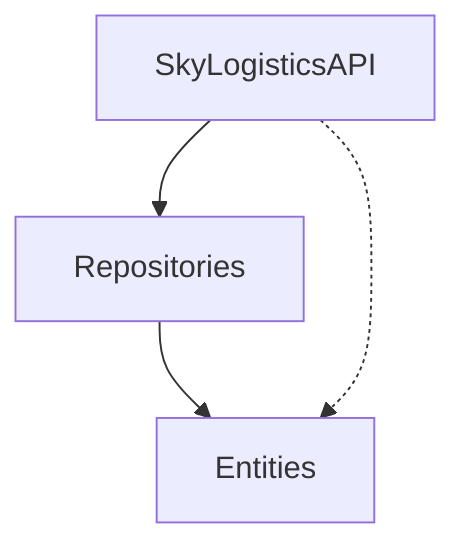

# SkyLogistics - Autonomous Drone Delivery System
## Otonom Drone Teslimat Sistemi


## 📖 Introduction / Giriş

**SkyLogistics** is a backend API designed to manage a fleet of autonomous delivery drones. Built using **ASP.NET Core** and **Entity Framework Core**, this project demonstrates a robust **N-Tier Architecture** implementation.

**SkyLogistics**, otonom teslimat drone filosunu yönetmek için tasarlanmış bir backend API projesidir. **ASP.NET Core** ve **Entity Framework Core** kullanılarak geliştirilen bu proje, sağlam bir **N-Katmanlı Mimari** uygulamasını gösterir.

---

## 🚀 Features / Özellikler

- **Drone Management**: Register and track drones.
- **Status Monitoring**: Real-time tracking of drone status (Idle, Flying, Charging, Maintenance).
- **Battery Health**: Monitor battery levels to ensure operational efficiency.
- **RESTful API**: Full CRUD operations for external system integration.

- **Drone Yönetimi**: Drone kaydı ve takibi.
- **Durum İzleme**: Drone durumunun gerçek zamanlı takibi (Boşta, Uçuşta, Şarjda, Bakımda).
- **Pil Sağlığı**: Operasyonel verimliliği sağlamak için pil seviyelerinin izlenmesi.
- **RESTful API**: Harici sistem entegrasyonu için tam CRUD işlemleri.

---

## 🏗 Architecture / Mimari

The solution follows a strict separation of concerns using N-Tier Architecture:
Çözüm, N-Katmanlı Mimari kullanarak sorumlulukların kesin bir şekilde ayrılmasını izler:

1.  **Presentation Layer (SkyLogisticsAPI)**: Handles HTTP requests and responses.
2.  **Data Access Layer (Repositories)**: Manages database operations and abstraction.
3.  **Domain Layer (Entities)**: Defines the core data models.



---

## 🛠 Tech Stack / Teknoloji Yığını

- **Framework**: .NET 6.0 / 7.0 / 8.0 (ASP.NET Core)
- **ORM**: Entity Framework Core
- **Database**: SQL Server
- **Language**: C#
- **Architecture**: N-Tier (Layered) Architecture, Repository Pattern

---

## 📂 Project Structure / Proje Yapısı

```text
SkyLogistics/
├── SkyLogistics.sln             # Solution file
├── Entities/                    # Domain Layer
│   ├── Models/
│   │   └── Drone.cs             # Drone Entity
├── Repositories/                # Data Access Layer
│   ├── Contracts/               # Interfaces (IRepositoryBase, IDroneRepository)
│   └── EFCore/                  # Implementations (DbContext, Repositories)
└── SkyLogisticsAPI/             # Presentation Layer
    ├── Controllers/             # API Controllers
    ├── Extensions/              # Service Configurations
    └── appsettings.json         # Configuration
```

---

## ⚡ Getting Started / Başlangıç

### Prerequisites / Gereksinimler
- .NET SDK
- SQL Server
- Postman (for testing)

### Installation / Kurulum

1.  **Clone the repository / Depoyu klonlayın**
    ```bash
    git clone https://github.com/yourusername/SkyLogistics.git
    cd SkyLogistics
    ```

2.  **Configure Database / Veritabanını Yapılandırın**
    Update `SkyLogisticsAPI/appsettings.json` with your connection string.
    `SkyLogisticsAPI/appsettings.json` dosyasını bağlantı dizesi ile güncelleyin.

3.  **Apply Migrations / Göçleri Uygulayın**
    ```bash
    dotnet tool install --global dotnet-ef
    dotnet ef database update --project Repositories --startup-project SkyLogisticsAPI
    ```

4.  **Run the Application / Uygulamayı Çalıştırın**
    ```bash
    dotnet run --project SkyLogisticsAPI
    ```

---

## 🔌 API Endpoints / API Uç Noktaları

| Method | Endpoint | Description / Açıklama |
| :--- | :--- | :--- |
| `GET` | `/api/drones` | List all drones / Tüm dronları listele |
| `GET` | `/api/drones/{id}` | Get drone by ID / ID ile drone getir |
| `POST` | `/api/drones` | Register a new drone / Yeni drone kaydet |

**Sample JSON Body for POST:**
```json
{
  "model": "Phantom 4 Pro",
  "serialNumber": "DR-2026-001",
  "batteryLevel": 100.0,
  "status": "Idle"
}
```

---

## 👥 Contact / İletişim

**Developer**: Ahmad Shahram AREEB
**Document ID**: TDD-SKY-001

---

*This project is based on the Technical Design Document (TDD-SKY-001) dated 2026-01-27.*
